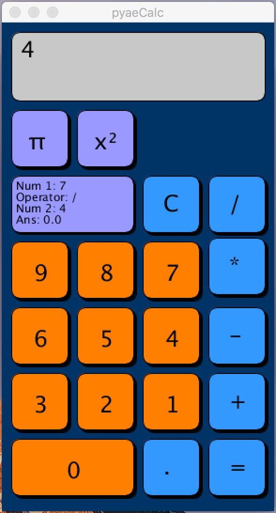

# Max Chen's Programming Portfolio

A collection of computer programming projects made by me

## ASCII Chess - Group Project
  An ASCII Chess game made with C++
   
  [ASCII Chess](https://github.com/Arcane-Panda/Chess)
  
  
  
## Simple Calculator - Solo Project
  A simple calculator made with Javascript
  
  [Simple Calculator](https://github.com/MaxChen11/Calculator)

   
  

## A Poem

  Roses are red
  
  Violets are blue
  
  Unexpected {
  
  On line 42
